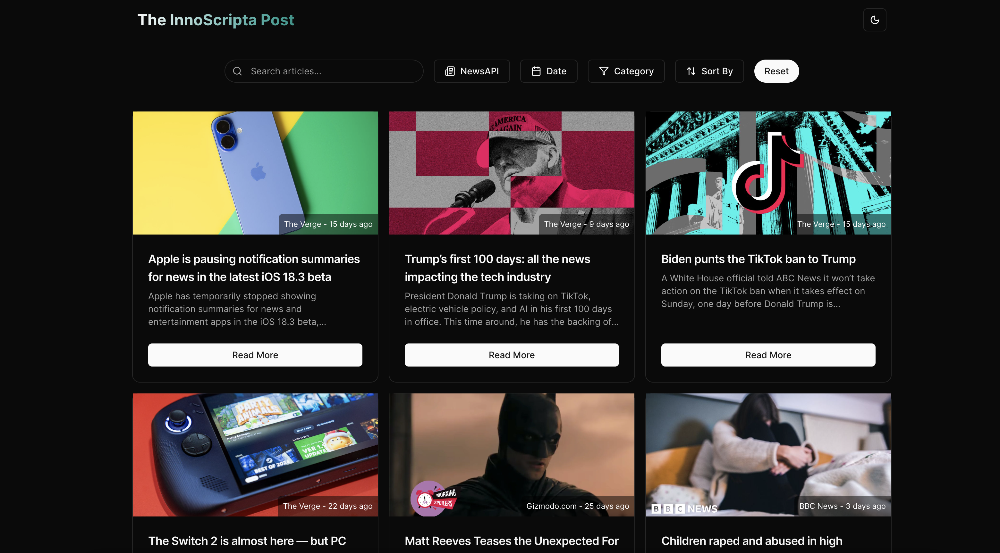
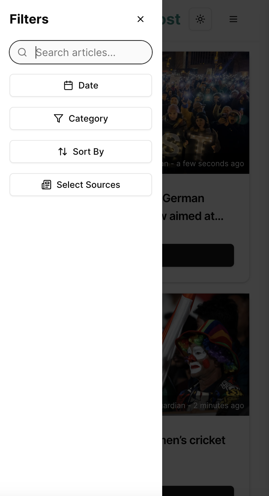

# Innoscripta News Aggregator

A **single-page news aggregator application** built with **React, TypeScript, Vite, and Tailwind CSS**. This application fetches articles from multiple news sources and presents them in a clean, user-friendly interface. It allows users to **search, filter, and customize their news feed**.

# Innoscripta News Aggregator

A **single-page news aggregator application** built with **React, TypeScript, Vite, and Tailwind CSS**. This application fetches articles from multiple news sources and presents them in a clean, user-friendly interface. It allows users to **search, filter, and customize their news feed**.

## 🖼️ Screenshots

### 🔹 Home Page



### 🔹 Mobile View

&nbsp;

## 🚀 Demo

[Live Demo](https://inno-scripta-news-aggregator-z137sujzr-bilalsahid929s-projects.vercel.app/)

## 📌 Features

- Fetches breaking news from **NewsAPI.org, The New York Times, and The Guardian**.
- **Search functionality**: Users can search articles by **keyword**.
- **Filter articles** by **date, category, and source**.
- **Personalized news feed**: Users can customize their feed based on selected **sources and categories**.
- **Responsive design** optimized for **mobile and desktop**.
- **Light and Dark mode support** for **mobile and desktop**.
- **Infinite scroll** for seamless browsing.
- **Error handling** to provide a smooth user experience.
- **Docker containerization** for easy deployment.

## 🛠️ Tech Stack

- **React** (Frontend development)
- **TypeScript** (Ensures type safety and maintainability)
- **Vite** (Fast build tool for modern web applications)
- **Tailwind CSS** (Utility-first CSS framework)
- **Redux Toolkit** (State management)
- **Docker** (Containerization)

---

## 🔧 Installation & Setup

### 1️⃣ Clone the Repository

```sh
git clone https://github.com/bilalsh-dev/innoScripta-news-aggregator.git
cd innoscripta-news-aggregator
```

### 2️⃣ Install Dependencies

```sh
pnpm install
```

### 3️⃣ Configure Environment Variables

Create a `.env` file from the provided `.env.example`.

```sh
cp .env.example .env
```

Fill in your **API keys** from NewsAPI, The Guardian, and The New York Times.

### 4️⃣ Run Locally

```sh
pnpm run dev
```

The app will be available at: [http://localhost:5173](http://localhost:5173)

---

## 🐳 Running with Docker

### 1️⃣ Build Docker Image

```sh
docker build -t news-app:latest .
```

### 2️⃣ Run the Container

```sh
docker run -p 5173:5173 news-app:latest
```

The app will now be accessible at: [http://localhost:5173](http://localhost:5173)

---

## 📦 Running with Docker Compose

If you prefer using **Docker Compose**, run the following command:

```sh
docker-compose up --build
```

This will automatically:

- Build the image
- Install dependencies
- Start the container

To stop the application, use:

```sh
docker-compose down
```

---

## 📜 Project Structure

```
innoscripta-news-app/
│── public/                     # Public assets
│── assets/                      # Static assets
│── components/                  # Reusable UI components
│   ├── layout/                  # Layout components
│   ├── theme/                   # Theme and styling-related
│   ├── ui/                      # Generic UI components (buttons, modals, etc.)
│   ├── error-boundary.tsx        # Global error boundary
│── features/                     # Feature-based modules
│   ├── feed/                     # News feed feature
│       ├── api/                  # API calls for fetching news
│       ├── components/           # UI components for the feed
│       ├── hooks/                # Custom hooks for feed logic
│       ├── slices/               # Redux slices for state management
│       ├── index.ts              # Export entry point
│       ├── types.ts              # TypeScript types
│── filters/                      # Filtering functionality
│   ├── components/               # UI components for filters
│   ├── hooks/                    # Hooks related to filtering
│   ├── slices/                   # Redux slices for filters
│   ├── index.ts                  # Export entry point
│   ├── types.ts                  # TypeScript types
│── hooks/                         # Global custom hooks
│── lib/                           # Library utilities
│   ├── constants.ts               # Constant values
│   ├── utils.ts                   # Utility functions
│── store/                         # Redux store configuration
│── App.css                        # Global styles
│── App.tsx                        # Main application component
│── index.css                      # Global CSS
│── main.tsx                       # React entry point
│── vite-env.d.ts                   # TypeScript Vite environment types
│── .dockerignore                   # Docker ignore file
│── .env                             # Environment variables
│── .gitignore                       # Git ignore file
├── .env.example       # Environment variables template
├── Dockerfile         # Docker configuration
├── docker-compose.yml # Docker Compose configuration
├── package.json       # Dependencies and scripts
└── README.md          # Project documentation
```

---

## 📄 License

This project is **MIT Licensed**.

---

## 👨‍💻 Author

[Bilal Shahid](https://github.com/bilalsh-dev)

Feel free to contribute by submitting a pull request! 🚀
